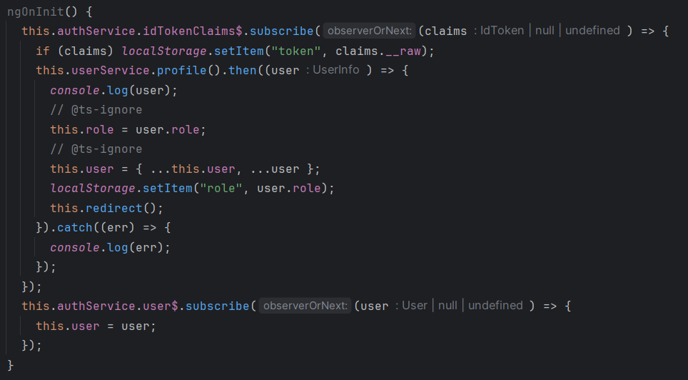
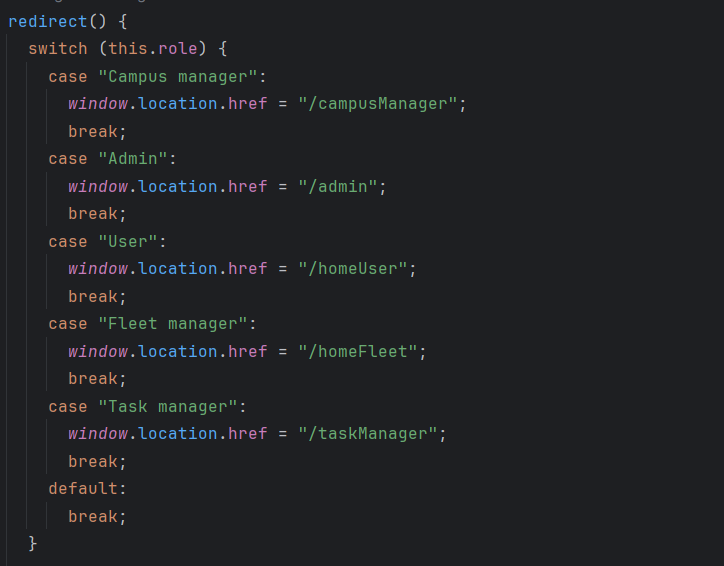
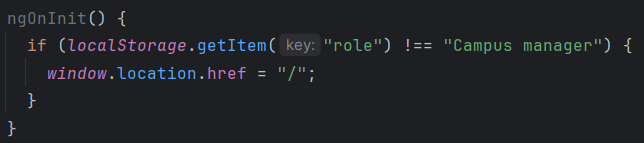
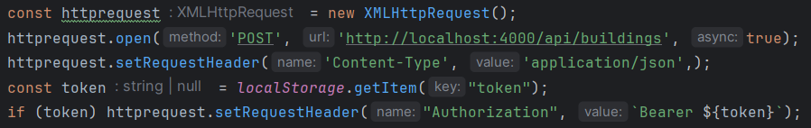
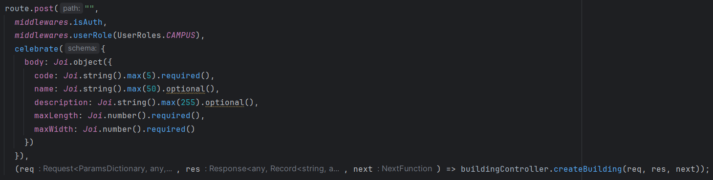
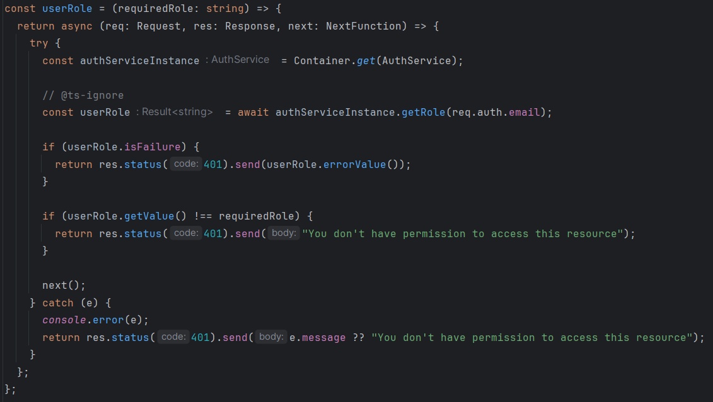
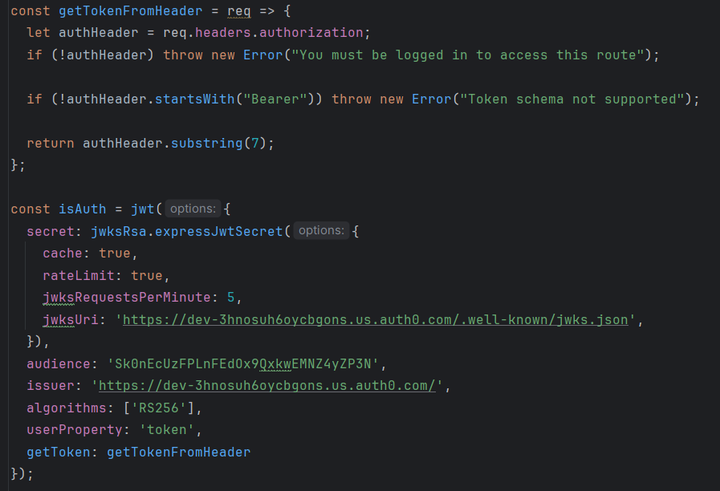

# US1310/1320 #
In this markdown file, will be describing the process of creating a new building, where the authentication is implemented.

## LOGIN ##
Using Auth0, the user is logged in, and the token is stored in the local storage. The token is used to authenticate the user in the backend:

After that, the user is redirected to their home page:

If a user try to access a page that requires authentication, and the user is not logged in, the user is redirected to the login page:

## BACKEND REQUESTS ##
In the backend, when a user (in this example a campus manager) requests a service, the HTTP request will have a header with the authorization token (if there is no token, the request will be rejected):

With the token, the backend can verify if the user is authenticated, and if the user has the permission to access the requested service:

For that to be possible, 2 middlewares were created:
- isAuth: that verifies if the user is authenticated

- userRole: that verifies if the user has the permission to access the requested service

