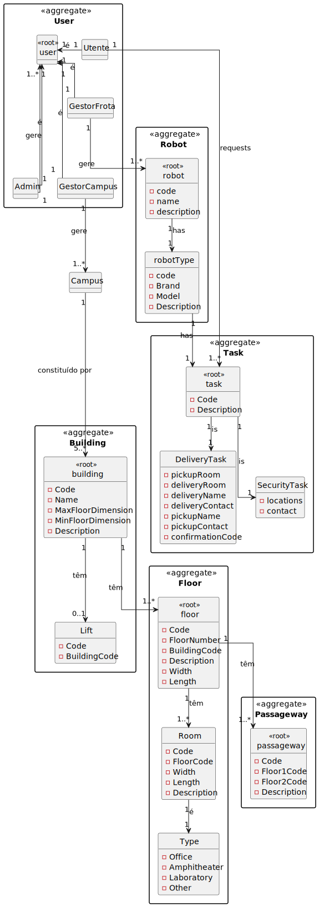

# Welcome #

to the RobDroneGo documentation.

## Introduction ##

This is the documentation for the RobDroneGo project.

## Domain Model ##

## Views ##

* ## [Logical View](logicalView.md) ##
* ## [Process View](processView.md) ##
* ## [Development View](developmentView.md) ##
* ## [Scene View](sceneView.md) ##

## Teams Decisions ##

* ## [Decisions](decisions.md) ##
