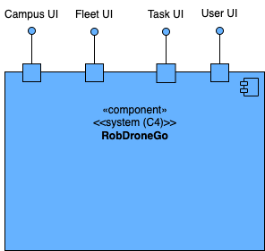
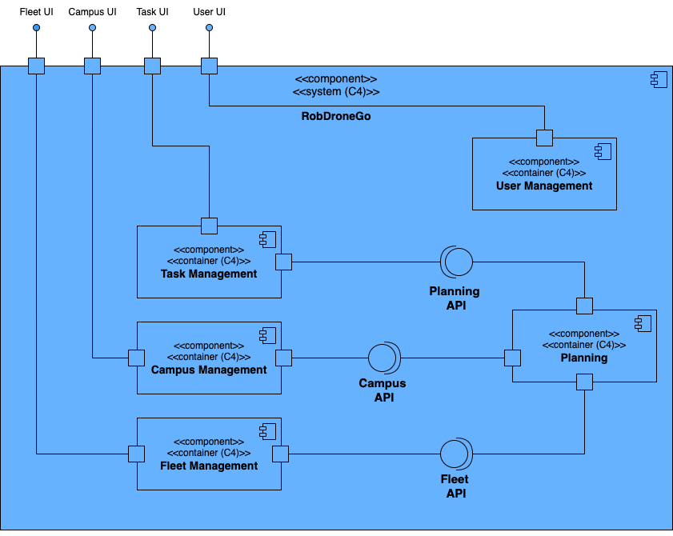
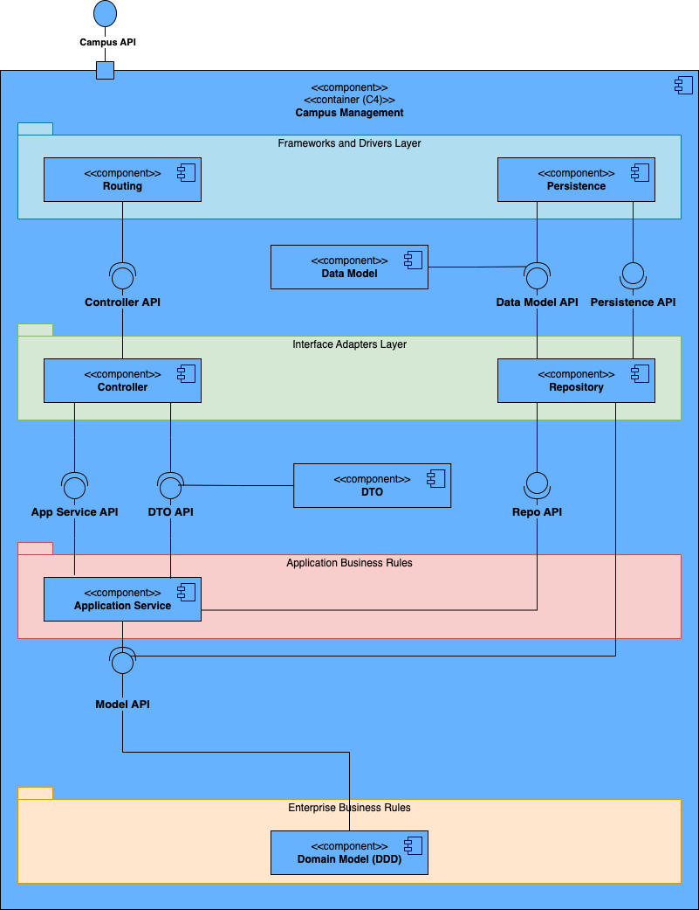
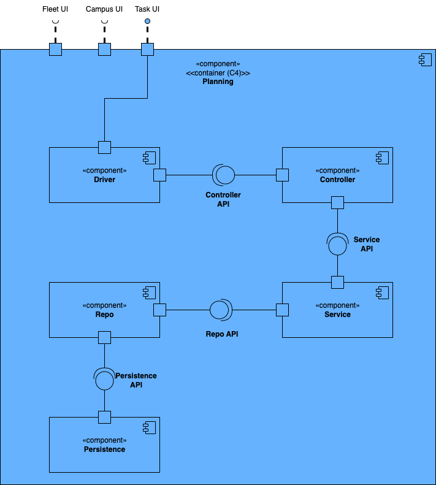

# Logical Views #

## Introduction ##
This document contains the logical views for the RobDroneGo project.

### Level 1 ###
The following diagram shows the logical view Level 1 for the RobDroneGo project.

### Level 2 ###
The following diagram shows the logical view Level 2 for the RobDroneGo project.

### Level 3 ###
The following diagram shows the logical view Level 3 for the RobDroneGo project.

### Campus manager ###

### Fleet manager ###

### Task manager ###

### Planning ###

