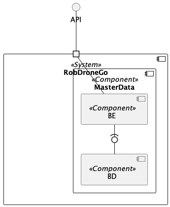

# Logical Views #

## Introduction ##

This document contains the logical views for the RobDroneGo project.

### Level 1 ###

The following diagram shows the logical view Level 1 for the RobDroneGo project.

### Level 2 ###

The following diagram shows the logical view Level 2 for the RobDroneGo project.

### Level 3 ###

The following diagram shows the logical view Level 3 for the RobDroneGo project.

