# Process Views #

## Introduction ##

This document contains the process views for the RobDroneGo project.

## Level 1 ##

The following diagram shows the process level 1 views for the RobDroneGo project.

# US150 #
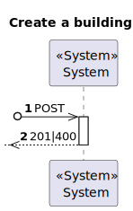

# US160 #

# US170 #

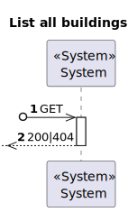

# US180 #

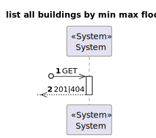

# US190 #

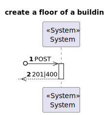

# US200 #

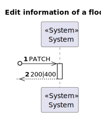

# US210 #

# US220 #

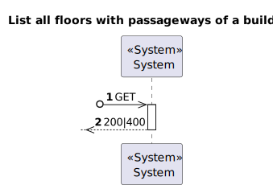

# US230 #

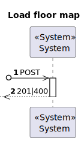

# US240 #

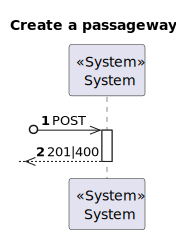

# US250 #

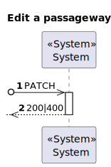

# US260 #

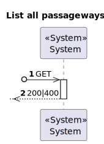

# US270 #

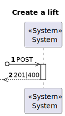

# US280 #

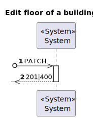

# US290 #

# US350 #

# US360 #

# US370 #

# US380 #

## Level 2 ##

The following diagram shows the process level 2 views for the RobDroneGo project.

# US150 #

# US160 #

# US170 #

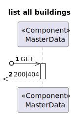

# US180 #

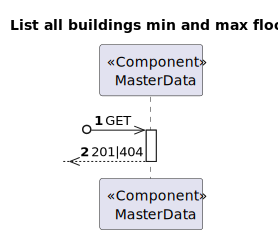

# US190 #

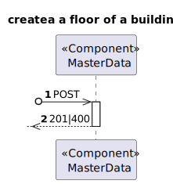

# US200 #

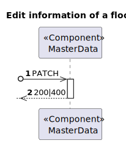

# US210 #

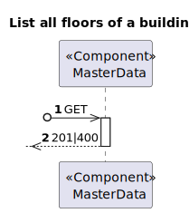

# US220 #

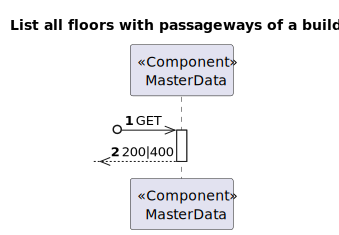

# US230 #

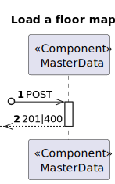

# US240 #

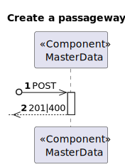

# US250 #

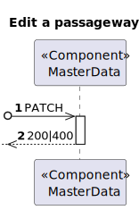

# US260 #

# US270 #

# US280 #

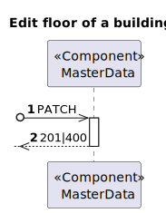

# US290 #

# US350 #

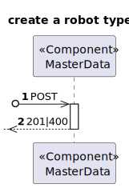

# US360 #

# US370 #

# US380 #

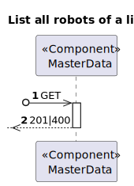

## Level 3 ##

The following diagram shows the process level 3 views for the RobDroneGo project.

# US150 #

# US160 #

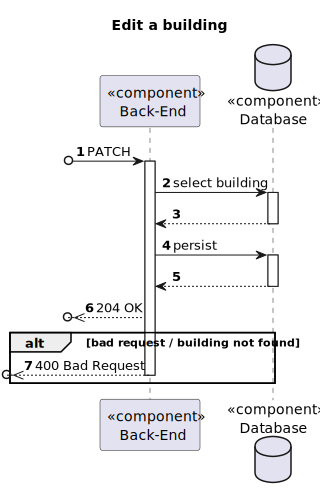

# US170 #

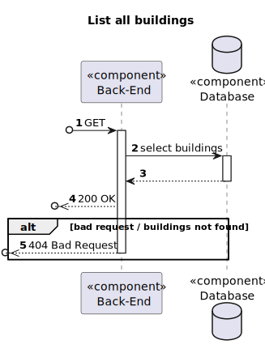

# US180 #

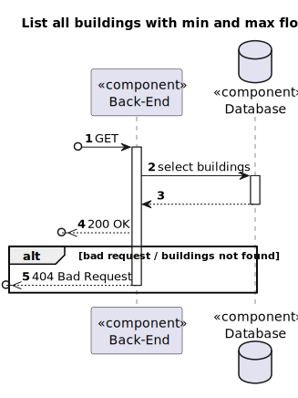

# US190 #

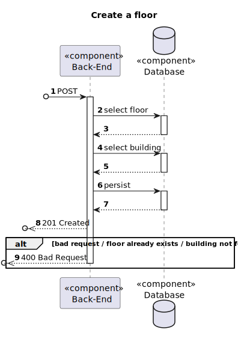

# US200 #

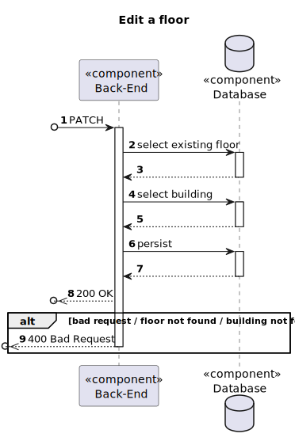

# US210 #

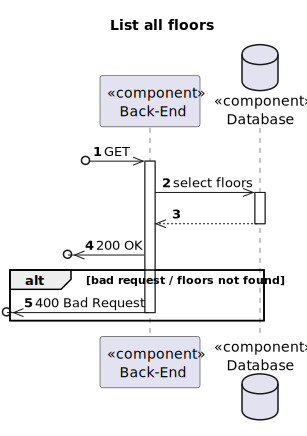

# US220 #

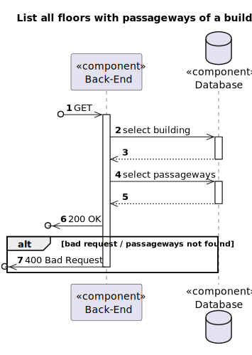

# US230 #

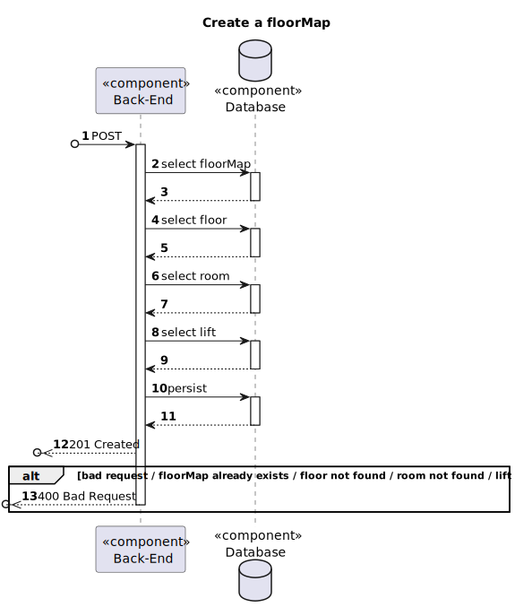

# US240 #

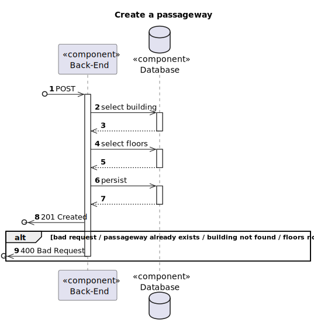

# US250 #

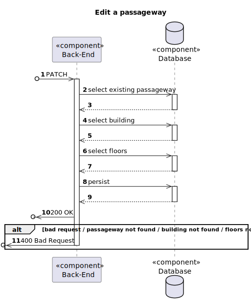

# US260 #

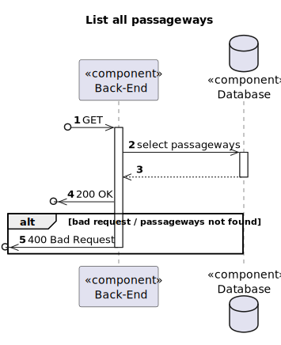

# US270 #

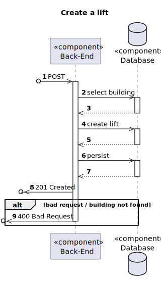

# US280 #

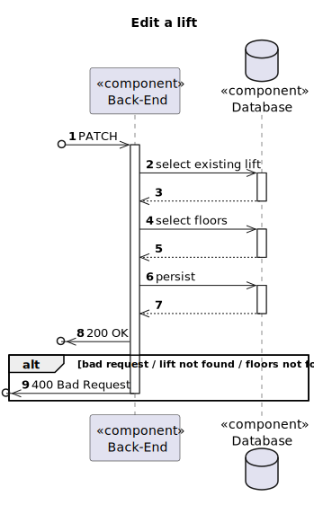

# US290 #

# US350 #

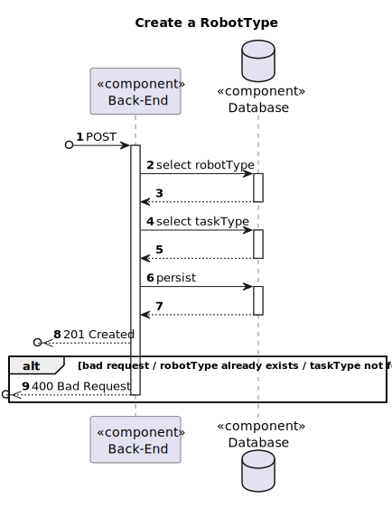

# US360 #

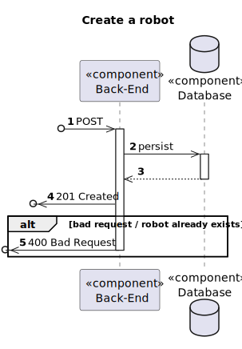

# US370 #

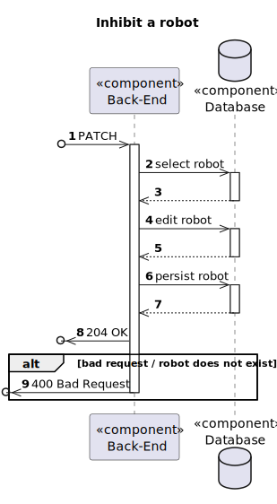

# US380 #

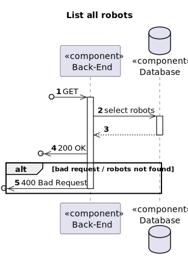

