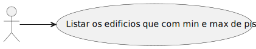
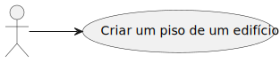
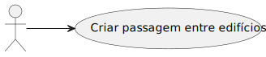
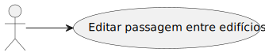

# Scene view #

## Introduction ##

This document contains the scene views for the RobDroneGo project.

## Level 1 ##

The following diagram shows the scene level 1 views for the RobDroneGo project.

# US150 #

# US160 #

# US170 #

# US180 #

# US190 #

# US200 #

# US210 #

# US220 #

# US230 #

# US240 #

# US250 #

# US260 #

# US270 #

# US280 #

# US290 #

# US350 #

# US360 #

# US370 #

# US380 #

